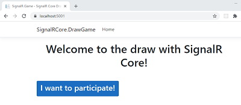
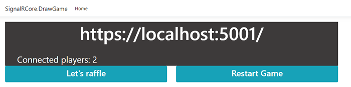

# DrawGrameSignalRCore

<!-- ABOUT THE PROJECT -->
## About The Project
This project is a very simple draw game based on [SignalR Core](https://docs.microsoft.com/en-us/aspnet/core/signalr/introduction?view=aspnetcore-3.1).

It uses two SignalR Hubs, one based on [magic strings](https://docs.microsoft.com/en-us/aspnet/core/signalr/hubs?view=aspnetcore-3.1#send-messages-to-clients) and a [strongly typed one](https://docs.microsoft.com/en-us/aspnet/core/signalr/hubs?view=aspnetcore-3.1#strongly-typed-hubs).

Just to keep it simple, we are using the [Javascript client](https://docs.microsoft.com/en-us/aspnet/core/signalr/javascript-client?view=aspnetcore-3.1) with Razor Pages.

<!-- USAGE EXAMPLES -->
## Usage
Inside the project folder, run the following command from the cmd, Powershell or Bash

`dotnet run`

Then you can browse to https://localhost:5001/ to start playing. I recommend open two tabs to simulate two players.

Additionally, open a third tab to browse to https://localhost:5001/controlpanel, which it's a kind of "Control Panel" to start or restart the draw.

<!-- CONTRIBUTING -->
## Contributing
Feel free to contribute. Any contributions you make are **greatly appreciated**.

1. Fork the Project
2. Create your Feature Branch (`git checkout -b feature/AmazingFeature`)
3. Commit your Changes (`git commit -m 'Add some AmazingFeature'`)
4. Push to the Branch (`git push origin feature/AmazingFeature`)
5. Open a Pull Request

### Notes
Gifs used in this project are from https://gifer.com/en